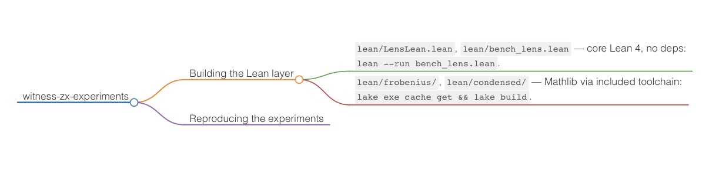

# When Does the Record of a Computation Matter?

Every computation produces two things: a pair of endpoints, and a record of how
the second was obtained from the first. This repository calls that record the
**witness**, and asks when keeping it is worth the cost. The answer is measured
on three substrates — gradient-descent training of a small language model in two
domains, and a superconducting quantum device — under fifteen pre-registered
protocols, each committed with a timestamp before the corresponding run.

The write-up is `paper/` (LaTeX source for the research report). Every table in
it is re-derivable from the committed artifacts by `verify.py`.

## The experiments

| part | domain | question | verdict |
|---|---|---|---|
| **I** | Mathlib code edits | does explicit diff supervision beat endpoint pairs? | **null** (p = 0.152) — the diff is recoverable, so writing it out adds nothing |
| **II** | IBM `ibm_fez` | do machine-verified ZX-optimized circuits beat their baselines? | **yes**, up to +0.067 — but the predicted *ordering* is falsified; the gain tracks duration, not gate count |
| **III** | LeanDojo tactic steps | same question where recovery is search | **yes**, +0.024 to +0.050 across three seeds; 68–76% of it is content, not format |
| **IV** | synthetic operation systems | does the witness *fiber* predict the gap? | **falsified** — exact Bayes ceilings collapse at both ends, so no monotone law can exist |
| **V** | budget sweep on Part III | can endpoint data buy the trace advantage? | **no** across a 32× range; extrapolated zero-crossing ≈ 8M examples |
| **VI** | the cost channel | does an intermediate channel help in proportion to available information? | **falsified as registered** (Spearman −0.80); the channel helps everywhere but least where it should help most |

Three further predictors were registered and killed by exact computation before
any training run — the fiber (Part IV), cost-function identifiability, and
variance-alone sample complexity (`REGISTERED_NEGATIVE.md` and its dated
addenda). A registered **verification experiment** (does trace supervision help
*checking*, not just generating?) stopped at its own anchor twice and is closed
as uninterpretable; see `proof_witness/PREREG_VERIF.md`.

Two registered hardware designs (R1, R2) were confounded as executed and are
reported alongside their corrected reruns (R1′, R2′), not withdrawn.

## Layout

    paper/              LaTeX source for the research report
    verify.py           re-derives the reported tables from committed artifacts

    witness/            Part I: mining, training, and eval for Mathlib edits
    results/            Part I: per-item eval JSON for all six checkpoints

    quantum/            Part II: ZX benchmarking, hardware runner, calibration
    quantum/qhw_package/  the four certified circuit pairs, as shipped (QASM)
    quantum/qhw_results/  raw hardware JSON + recovered execution-time calibration
    mirror/             Part II: the mirror protocol and the DD reruns

    proof_witness/      Part III: LeanDojo tactic prediction (+ Part V scripts,
                        the stratum audits, and the closed verification experiment)
    part_iv/            Part IV: exact fiber/ceiling computation and the sweep
    part_v/             Part V: registration and runbook (scripts live in
                        proof_witness/, which holds the shared data/)
    cost_channel/       Part VI: the cost channel, its search evaluation, and
                        the exact ceiling table it was registered against

    lean/               the formal layer (see below)
    benchmarks_report.md  classical ZX suite: 46% aggregate T-count reduction,
                        2753 vs 2829 against T-par, equality witnesses green

### Pre-registrations

Each part registers its predictions and its falsification conditions before
running. `PREREG_ROUND2.md`, `PREREG_ROUND3.md`, `REGISTERED_NEGATIVE.md`, and
`<part>/PREREGISTRATION.md` carry the protocols and the dated verdicts; the
ledger table in the paper maps each to its registering commit.

## Verifying the claims

    python3 verify.py

Dependencies: `pyzx`, `qiskit`, `qiskit-aer`, `scipy`, `numpy`. The script
re-derives the reported numbers from the committed artifacts rather than
trusting them: independent pair-equality verification from the QASM, manifest
counts, transpile identity against the recorded runs, noiseless Aer
reproduction, hardware-delta significance, ceiling saturation against the
recovered 2026-07-18 calibration, the Part I paired statistics from per-item
scores, the Part III and Part V paired statistics, and the exact Part IV and
Part VI ceiling tables.

The Lean layer is checked separately: `lean lean/LensLean.lean`.

## Building the Lean layer

- `lean/LensLean.lean`, `lean/bench_lens.lean` — core Lean 4, no dependencies:
  `lean --run bench_lens.lean`. Proves the seven category/monoidal laws for
  lenses (reverse-mode AD), all by `rfl`.
- `lean/frobenius/`, `lean/condensed/` — Mathlib via the included toolchain:
  `lake exe cache get && lake build`.
- `part_iv/WitnessRecoverability.lean` — the recoverability axis: `free_faithful`
  and `abelian_not_faithful`, the latter by kernel computation. No `sorry`, no
  custom axioms.

The Frobenius/cobordism infrastructure behind the ZX rewrite rules lives in the
companion repository
[Liquid-TQFT-lean-CMCM](https://github.com/seanm27lol/Liquid-TQFT-lean-CMCM),
which is the canonical formal source.

## Reproducing the experiments

Each part's `README.md` gives the exact commands, and every part smoke-tests on
CPU first as registered. In outline:

- **Part I** — `witness/mine_mathlib_diffs.py`, then `train_arms.py` (20M tokens,
  then a 1M-token adaptation), then `eval_arms.py` at n = 300.
- **Part II** — `quantum/bench_zx.py` for the classical suite, then the hardware
  runner, one interleaved job per pair. Requires `QISKIT_IBM_TOKEN` in the
  environment; no credentials are committed.
- **Part III** — `proof_witness/`: `prep_data.py`, `train.py`, `eval.py`, `stats.py`.
- **Part IV** — `part_iv/fiber.py --L 6` and `ceiling.py`, both exact enumeration.
- **Part V** — `train_stage1.py` once per arm, then `train_stage2.py` and
  `eval_budget.py` at each budget, then `stats_budget.py`.
- **Part VI** — `cost_channel/`: `gen_cost.py`, `train_cost.py`, `eval_cost.py`
  per system and arm, then `stats_cost.py` and `search_cost.py`.

## Note on the PDF in the repository root

`When_Does_the_Record_of_a_Computation_Matter_plain_version.pdf` is a
**superseded 2026-07-26 snapshot**, written before Part VI, the verification
experiment, and the second and third registered negatives. It covers twelve
protocols where the current draft covers fifteen. The current source of truth
is `paper/`.

## License

MIT (`LICENSE`). Idea credit for the cost channel and the search-versus-checking
framing: Sebastien Seboih, credited in `cost_channel/PREREGISTRATION.md` and in
the paper's acknowledgments.
